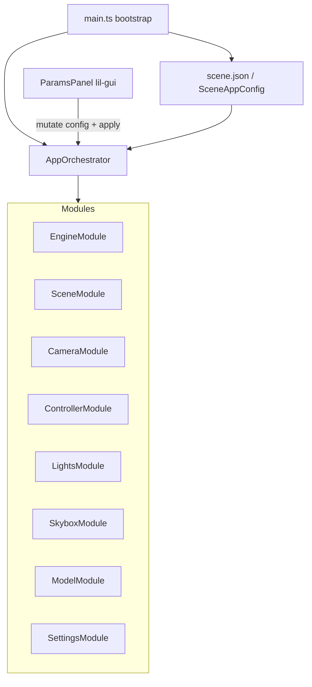
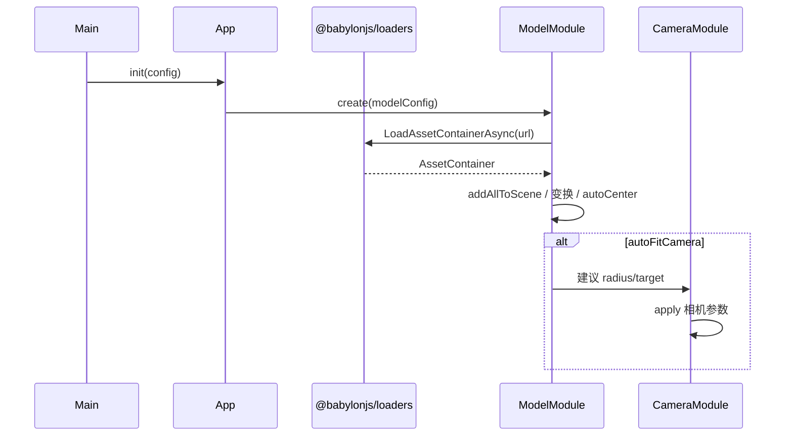
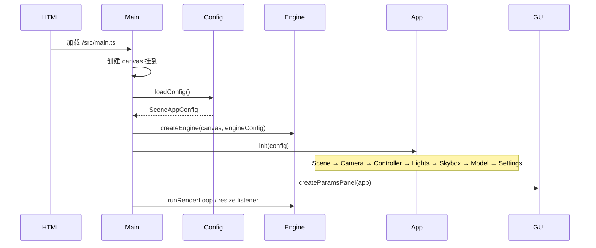

# Babylon.js 厂房模型加载技术方案

> 适用项目：广州双叶能源站数字孪生（Vite + TypeScript + Babylon.js）  
> 文档路径：`public/docs/babylon-modular-scene-tech.md`  
> 官方文档入口：[Babylon.js Docs](https://doc.babylonjs.com/journey/forum/)

---

## 1. 目标与约束

### 1.1 目标

在空白 Vite + TypeScript 脚手架上，建立可落地的 Babylon.js 场景体系，满足：

1. **方法解耦**：相机 / 控制器 / 场景 / 灯光 / 模型 / 天空盒 / 基本设置 各自独立模块。
2. **数据驱动**：运行时以 `scene.json`（及 TS 类型）为唯一配置源，模块只消费配置切片。
3. **HDR 天空盒**：支持 `.hdr` / 预过滤 `.env` 环境贴图，并可同步作为 IBL（`environmentTexture`）。
4. **可视化调参**：lil-gui 面板实时改参看效果，支持导出 JSON 回写配置。

### 1.2 约束

| 项 | 约定 |
|----|------|
| 技术栈 | Vite 8 + TypeScript，暂不引入 Vue / React |
| 3D 引擎 | `@babylonjs/core` + `@babylonjs/loaders` |
| 调参 UI | lil-gui（主）+ 可选 `@babylonjs/inspector` |
| 厂房模型源文件 | 仓库外：`../广州双叶厂房.glb`（相对本仓库根目录的上级） |
| 运行时模型路径 | `public/models/广州双叶厂房.glb` → URL `/models/广州双叶厂房.glb` |
| 本阶段交付 | **仅技术方案文档**；实现代码按本文后续清单推进 |

### 1.3 非目标（本阶段不做）

- 业务侧设备点位 / 告警 / 实时数据接入
- WebXR、物理引擎、复杂后期管线
- 服务端配置下发与多场景切换后台

---

## 2. 技术选型与依赖

### 2.1 依赖清单

```json
{
  "dependencies": {
    "@babylonjs/core": "^8.x",
    "@babylonjs/loaders": "^8.x",
    "lil-gui": "^0.20.x"
  },
  "devDependencies": {
    "@babylonjs/inspector": "^8.x",
    "typescript": "~6.0.2",
    "vite": "^8.2.0"
  }
}
```

> Inspector 建议仅开发态动态 `import()`，避免生产包体积膨胀。

### 2.2 选型说明

| 项 | 选型 | 理由 |
|----|------|------|
| 运行时 | `@babylonjs/core` + `@babylonjs/loaders` | ESM + Tree-shaking，契合 Vite |
| 相机 | `ArcRotateCamera` | 厂房俯视/环绕观察最常用 |
| 控制器 | 相机内置 `inputs`（鼠标/触控/键盘） | 与相机解耦配置，单独模块管理限位与惯性 |
| 模型 | `SceneLoader.ImportMeshAsync` 或 `LoadAssetContainerAsync` | 官方推荐 GLB/GLTF 加载方式 |
| 天空盒 / IBL | `CubeTexture.CreateFromPrefilteredData`（`.env`）或 `HDRCubeTexture`（`.hdr`）+ `scene.environmentTexture` | 支持 HDR 环境贴图与 PBR 反射 |
| 配置驱动 | `public/config/scene.json` + `SceneAppConfig` 类型 | 数据与代码分离，GUI 可导出回写 |
| 可视化调参 | **lil-gui** + 可选 Inspector | 无前端框架时轻量、绑定对象即可实时 `apply` |

### 2.3 关键官方能力索引

- 入门与 Forum 使用：[Journey / Forum](https://doc.babylonjs.com/journey/forum/)
- 文件导入与 GLTF/GLB：Features → Importers
- 天空盒与环境：Features → Environment / HDR Environment
- 调试：Inspector

---

## 3. 总体架构与数据流

### 3.1 架构图



### 3.2 设计原则

1. **单一配置源**：内存中的 `SceneAppConfig` 是真相；磁盘 JSON 是初始值与导出目标。
2. **模块无交叉引用**：模块之间不互相 `import` 业务逻辑，只通过 `AppContext`（`engine` / `scene` / `camera` 等句柄）协作。
3. **统一生命周期**：每个模块实现 `create` / `apply` / `dispose`。
4. **增量更新优先**：GUI 改参尽量走 `apply`，仅在资源 URL 变更等场景才重建（dispose + create）。

### 3.3 数据流

```
加载 scene.json
    → merge defaults
    → AppOrchestrator.create(all modules)
    → 启动 render loop
    → lil-gui 绑定 config
    → onChange → app.apply(section, slice)
    → 可选：导出 JSON → 覆盖 public/config/scene.json
```

---

## 4. 配置模型

### 4.1 TypeScript 类型（拟 `src/config/types.ts`）

```ts
export type Vec3 = [number, number, number]
export type Color3Tuple = [number, number, number] // 0~1

export interface EngineConfig {
  antialias: boolean
  adaptToDeviceRatio: boolean
  hardwareScalingLevel: number // 1 = 原生，>1 降采样提速
}

export interface SceneConfig {
  clearColor: [number, number, number, number]
  ambientColor: Color3Tuple
  environmentIntensity: number
  fog: {
    enabled: boolean
    mode: 'none' | 'exp' | 'exp2' | 'linear'
    color: Color3Tuple
    density: number
    start: number
    end: number
  }
}

export interface CameraConfig {
  type: 'arcRotate'
  name: string
  alpha: number
  beta: number
  radius: number
  target: Vec3
  minZ: number
  maxZ: number
  lowerRadiusLimit: number | null
  upperRadiusLimit: number | null
  lowerBetaLimit: number | null
  upperBetaLimit: number | null
  fov: number
}

export interface ControllerConfig {
  attachControl: boolean
  panningSensibility: number
  wheelPrecision: number
  angularSensibilityX: number
  angularSensibilityY: number
  inertia: number
  pinchPrecision: number
  allowPan: boolean
  allowZoom: boolean
  allowRotate: boolean
}

export type LightType = 'hemispheric' | 'directional' | 'point'

export interface LightConfig {
  id: string
  type: LightType
  enabled: boolean
  intensity: number
  color: Color3Tuple
  direction?: Vec3      // hemispheric / directional
  position?: Vec3       // point
  specular?: Color3Tuple
}

export interface SkyboxConfig {
  enabled: boolean
  /** 支持 .env（推荐）或 .hdr */
  hdrUrl: string
  format: 'env' | 'hdr'
  size: number
  blur: number          // createDefaultSkybox blur 0~1
  asEnvironmentTexture: boolean
  showMesh: boolean     // false 时仅 IBL，不显示天空盒网格
  rotationY: number     // 弧度
  level: number         // 纹理 level / 强度辅助
}

export interface ModelConfig {
  url: string
  enabled: boolean
  position: Vec3
  rotation: Vec3        // 欧拉角（弧度）
  scaling: Vec3
  autoCenter: boolean
  autoFitCamera: boolean
  receiveShadows: boolean
  castShadows: boolean
}

export interface SettingsConfig {
  exposure: number
  contrast: number
  toneMappingEnabled: boolean
  /** imageProcessing 色调映射类型，实现时映射到 Babylon 枚举 */
  toneMappingType: 'standard' | 'aces'
  shadowsEnabled: boolean
  inspectorEnabled: boolean
  showFps: boolean
}

export interface SceneAppConfig {
  version: number
  engine: EngineConfig
  scene: SceneConfig
  camera: CameraConfig
  controller: ControllerConfig
  lights: LightConfig[]
  skybox: SkyboxConfig
  model: ModelConfig
  settings: SettingsConfig
}
```

### 4.2 示例 `public/config/scene.json`

```json
{
  "version": 1,
  "engine": {
    "antialias": true,
    "adaptToDeviceRatio": true,
    "hardwareScalingLevel": 1
  },
  "scene": {
    "clearColor": [0.05, 0.07, 0.1, 1],
    "ambientColor": [0.1, 0.1, 0.1],
    "environmentIntensity": 1,
    "fog": {
      "enabled": false,
      "mode": "exp2",
      "color": [0.7, 0.8, 0.9],
      "density": 0.01,
      "start": 20,
      "end": 200
    }
  },
  "camera": {
    "type": "arcRotate",
    "name": "mainCamera",
    "alpha": -1.5707963267948966,
    "beta": 1.2,
    "radius": 80,
    "target": [0, 5, 0],
    "minZ": 0.1,
    "maxZ": 5000,
    "lowerRadiusLimit": 5,
    "upperRadiusLimit": 300,
    "lowerBetaLimit": 0.1,
    "upperBetaLimit": 1.5,
    "fov": 0.8
  },
  "controller": {
    "attachControl": true,
    "panningSensibility": 1000,
    "wheelPrecision": 50,
    "angularSensibilityX": 1000,
    "angularSensibilityY": 1000,
    "inertia": 0.9,
    "pinchPrecision": 50,
    "allowPan": true,
    "allowZoom": true,
    "allowRotate": true
  },
  "lights": [
    {
      "id": "hemi",
      "type": "hemispheric",
      "enabled": true,
      "intensity": 0.6,
      "color": [1, 1, 1],
      "direction": [0, 1, 0],
      "specular": [1, 1, 1]
    },
    {
      "id": "sun",
      "type": "directional",
      "enabled": true,
      "intensity": 1.2,
      "color": [1, 0.98, 0.95],
      "direction": [-0.5, -1, -0.3]
    }
  ],
  "skybox": {
    "enabled": true,
    "hdrUrl": "/env/studio.env",
    "format": "env",
    "size": 1000,
    "blur": 0.5,
    "asEnvironmentTexture": true,
    "showMesh": true,
    "rotationY": 0,
    "level": 1
  },
  "model": {
    "url": "/models/广州双叶厂房.glb",
    "enabled": true,
    "position": [0, 0, 0],
    "rotation": [0, 0, 0],
    "scaling": [1, 1, 1],
    "autoCenter": true,
    "autoFitCamera": true,
    "receiveShadows": true,
    "castShadows": true
  },
  "settings": {
    "exposure": 1,
    "contrast": 1,
    "toneMappingEnabled": true,
    "toneMappingType": "aces",
    "shadowsEnabled": false,
    "inspectorEnabled": false,
    "showFps": true
  }
}
```

> `camera.alpha` 等角度字段在 JSON 中使用数字字面量；`defaults.ts` 内可用 `Math.PI / 2` 书写，导出时序列化为数值。

### 4.3 配置加载规则（拟 `src/config/loadConfig.ts`）

1. `fetch('/config/scene.json')`
2. 与 `defaults.ts` 做深合并（缺字段补默认，防止 GUI / 模块读到 `undefined`）
3. 校验 `version`；不兼容时告警并回退默认配置
4. 模型 / HDR URL 必须以 `/` 开头的站点相对路径，禁止裸文件系统路径

---

## 5. 各模块设计与关键 API

### 5.1 统一模块接口

```ts
export interface AppContext {
  canvas: HTMLCanvasElement
  engine: import('@babylonjs/core').Engine
  scene: import('@babylonjs/core').Scene
  camera: import('@babylonjs/core').ArcRotateCamera | null
}

export interface SceneModule<TConfig> {
  readonly name: string
  create(ctx: AppContext, config: TConfig): void | Promise<void>
  apply(config: TConfig): void | Promise<void>
  dispose(): void
}
```

### 5.2 模块职责表

| 模块文件 | 配置切片 | 职责 |
|----------|----------|------|
| `src/core/engine.ts` | `engine` | 创建 `Engine`、resize、硬件缩放、抗锯齿 |
| `src/modules/scene.ts` | `scene` | `Scene`、clearColor、fog、`environmentIntensity` |
| `src/modules/camera.ts` | `camera` | 创建/更新 `ArcRotateCamera` |
| `src/modules/controller.ts` | `controller` | 绑定/解绑控制、惯性、灵敏度、轴开关 |
| `src/modules/lights.ts` | `lights[]` | 按 id 增删改灯光 |
| `src/modules/skybox.ts` | `skybox` | HDR/ENV 加载、天空盒网格、IBL 绑定 |
| `src/modules/model.ts` | `model` | GLB 加载、变换、居中、可选适配相机 |
| `src/modules/settings.ts` | `settings` | 图像处理、阴影总开关、Inspector、FPS |
| `src/core/app.ts` | 全部 | 编排模块、统一 `applySection`、生命周期 |
| `src/ui/paramsPanel.ts` | 全部（读写） | lil-gui 绑定与导出 |

### 5.3 AppOrchestrator 关键 API（拟）

```ts
class AppOrchestrator {
  async init(config: SceneAppConfig): Promise<void>
  getConfig(): SceneAppConfig
  /** section 为 'camera' | 'skybox' | ...；url 类变更可 forceRecreate */
  async applySection<K extends keyof SceneAppConfig>(
    section: K,
    patch: Partial<SceneAppConfig[K]>,
    options?: { forceRecreate?: boolean }
  ): Promise<void>
  async resetToDefaults(): Promise<void>
  exportConfig(): string  // pretty JSON
  dispose(): void
}
```

### 5.4 模块实现要点

**CameraModule**

- `create`：`new ArcRotateCamera(...)`，`camera.attachControl` 由 Controller 决定是否调用。
- `apply`：写 `alpha/beta/radius/target/minZ/maxZ/fov/limits`。

**ControllerModule**

- 读写 `camera.inertia`、`panningSensibility`、`wheelPrecision` 等。
- `allowPan/Zoom/Rotate === false` 时移除或禁用对应 input。

**LightsModule**

- 内部 `Map<string, Light>` 按 `id` 索引。
- `apply` 时：配置有、场景无 → 创建；两边都有 → 更新；场景有、配置无 → dispose。

**ModelModule**

- 优先 `LoadAssetContainerAsync`，便于整体 `dispose` 与再次加载。
- `autoCenter`：用 `BoundingInfo` 将根节点移到原点附近。
- `autoFitCamera`：根据包围盒半径写回 `camera.radius` / `target`（并可选同步更新 config，便于导出）。

**SkyboxModule / SettingsModule**

- 见第 7、8 节。

---

## 6. GLB 加载流程与资源放置约定

### 6.1 资源放置

| 资源 | 约定路径 | 浏览器 URL |
|------|----------|------------|
| 厂房 GLB | `public/models/广州双叶厂房.glb` | `/models/广州双叶厂房.glb` |
| HDR / ENV | `public/env/*.hdr` 或 `*.env` | `/env/...` |
| 场景配置 | `public/config/scene.json` | `/config/scene.json` |

实现前需将源文件复制到仓库内：

```text
源:  d:\work\github\广州双叶能源站数字孪生系统\广州双叶厂房.glb
目标: public/models/广州双叶厂房.glb
```

> 不要在配置里写 `d:\...` 绝对路径；浏览器无法直接读取本地磁盘路径。

### 6.2 加载流程



### 6.3 实现伪代码

```ts
import '@babylonjs/loaders/glTF'
import { LoadAssetContainerAsync } from '@babylonjs/core/Loading/sceneLoader'

async function loadPlant(scene: Scene, cfg: ModelConfig) {
  const container = await LoadAssetContainerAsync(cfg.url, scene)
  container.addAllToScene()
  const root = container.rootNodes[0] as TransformNode
  // position / rotation / scaling from cfg
  // optional: center using meshes' world bounding info
  return container
}
```

### 6.4 失败处理

- 404 / 解析失败：控制台错误 + GUI 状态提示，不中断引擎循环。
- URL 变更：`dispose` 旧 `AssetContainer` 再加载，避免网格泄漏。

---

## 7. HDR 天空盒 / IBL 方案

### 7.1 推荐路径：预过滤 `.env`

1. 使用 Babylon IBL 工具链（如 IBL Baker / 官方工具）将 HDR 转为 `.env`。
2. 运行时：

```ts
import { CubeTexture } from '@babylonjs/core/Materials/Textures/cubeTexture'

const env = CubeTexture.CreateFromPrefilteredData(cfg.hdrUrl, scene)
env.rotationY = cfg.rotationY
env.level = cfg.level

if (cfg.asEnvironmentTexture) {
  scene.environmentTexture = env
}

if (cfg.enabled && cfg.showMesh) {
  skyboxMesh = scene.createDefaultSkybox(env, true, cfg.size, cfg.blur)
}
```

优点：GPU 友好、加载快、与 PBR IBL 匹配最佳。

### 7.2 备选路径：直接 `.hdr`

```ts
import { HDRCubeTexture } from '@babylonjs/core/Materials/Textures/hdrCubeTexture'

const hdr = new HDRCubeTexture(cfg.hdrUrl, scene, 256 /* size */, false, true, false, true)
// 再按需赋给 environmentTexture / createDefaultSkybox
```

注意：

- `size`（如 256/512）影响内存与质量，需在 GUI 暴露或写进配置。
- 首次生成 mip / irradiance 可能卡顿，大屏场景优先 `.env`。

### 7.3 与场景参数联动

| 配置 | 作用 |
|------|------|
| `skybox.asEnvironmentTexture` | 控制是否写入 `scene.environmentTexture` |
| `scene.environmentIntensity` | 整体 IBL 强度 |
| `skybox.blur` | 天空盒材质模糊（`createDefaultSkybox`） |
| `skybox.rotationY` | 环境与天空盒同步旋转 |
| `skybox.showMesh` | 仅 IBL 时关闭网格，保留反射 |

### 7.4 URL 变更策略

- `hdrUrl` 或 `format` 变化 → `forceRecreate`：dispose 旧纹理与天空盒网格，再加载。
- 仅 `blur` / `rotationY` / `level` / `showMesh` → 增量 `apply`。

---

## 8. 可视化调参面板设计

### 8.1 技术选择

- **主面板**：`lil-gui`，绑定同一份 `config` 对象。
- **深度调试**：`settings.inspectorEnabled` 为 true 时动态加载 `@babylonjs/inspector` 并 `scene.debugLayer.show()`。

### 8.2 分组结构

```
Params
├── Engine
├── Scene
│   └── Fog
├── Camera
├── Controller
├── Lights
│   ├── hemi
│   └── sun
├── Skybox
├── Model
├── Settings
└── Actions
    ├── 导出 JSON
    ├── 复制到剪贴板
    └── 重置默认
```

### 8.3 绑定与更新

```ts
folder.add(config.camera, 'radius', 5, 300, 0.1)
  .onChange(() => app.applySection('camera', config.camera))

folder.add(config.skybox, 'blur', 0, 1, 0.01)
  .onChange(() => app.applySection('skybox', config.skybox))

folder.add(config.skybox, 'hdrUrl')
  .onFinishChange(() =>
    app.applySection('skybox', config.skybox, { forceRecreate: true })
  )
```

原则：

- 高频拖动参数用 `onChange` + 增量 `apply`。
- 路径类字符串用 `onFinishChange` + 可能的重建。
- Lights 数组：每个 light 一个子 folder，按 `id` 更新单灯。

### 8.4 导出 / 重置

- **导出 JSON**：`app.exportConfig()` → 触发浏览器下载 `scene.json`，开发者手动替换 `public/config/scene.json`。
- **复制到剪贴板**：便于粘贴进仓库文件。
- **重置默认**：`app.resetToDefaults()` 后刷新 GUI controllers（`gui.controllersRecursive().forEach(c => c.updateDisplay())`）。

### 8.5 布局与样式约定

- Canvas 全屏；GUI 固定右上角（lil-gui 默认即可）。
- 不引入卡片式业务 UI；本面板仅服务视觉调参与配置沉淀。

---

## 9. 启动时序与生命周期

### 9.1 建议目录结构

```text
src/
  main.ts
  style.css
  core/
    engine.ts
    app.ts
  config/
    types.ts
    defaults.ts
    loadConfig.ts
  modules/
    scene.ts
    camera.ts
    controller.ts
    lights.ts
    skybox.ts
    model.ts
    settings.ts
  ui/
    paramsPanel.ts
public/
  models/广州双叶厂房.glb
  env/
    studio.env          # 示例，可替换
  config/
    scene.json
  docs/
    babylon-modular-scene-tech.md   ← 本文档
index.html
package.json
```

### 9.2 启动时序



### 9.3 `main.ts` 伪代码

```ts
async function bootstrap() {
  const appRoot = document.querySelector('#app')!
  const canvas = document.createElement('canvas')
  canvas.style.width = '100%'
  canvas.style.height = '100%'
  appRoot.appendChild(canvas)

  const config = await loadConfig()
  const app = new AppOrchestrator(canvas)
  await app.init(config)
  createParamsPanel(app)

  window.addEventListener('resize', () => app.resize())
}

bootstrap()
```

### 9.4 销毁

页面热更新或主动卸载时调用 `app.dispose()`：倒序 dispose 各模块 → `engine.dispose()` → 移除 GUI 与事件监听。

---

## 10. 性能与已知风险

| 风险 | 影响 | 缓解 |
|------|------|------|
| 厂房 GLB 面数 / 材质过多 | 首屏慢、帧率低 | 建模侧减面；运行时 `hardwareScalingLevel`；按需关阴影 |
| HDR 原始文件过大 | 解析卡顿、内存高 | 优先 `.env`；限制 HDRCubeTexture size |
| `adaptToDeviceRatio` 在 4K/高 DPR | GPU 压力大 | GUI 可关；或提高 `hardwareScalingLevel` |
| GUI 每帧写相机 | 与用户拖拽冲突 | 仅在控制器未操作时写回，或导出前快照 |
| Inspector 打进生产包 | 体积大 | 动态 import + 仅 `import.meta.env.DEV` |
| 中文文件名 URL | 个别服务器编码问题 | Vite 一般可用；若异常改为 ASCII 文件名并改配置 |
| 模块 `apply` 重建过频 | 闪烁、泄漏 | URL 不变不重建；容器级 dispose 要彻底 |

### 10.1 建议验收指标（实现阶段）

- 桌面 Chrome：空场景 > 60 FPS；加载厂房后目标 ≥ 30 FPS（视模型复杂度调整）。
- 切换 HDR / 开关天空盒无明显资源泄漏（多次切换后 GPU 内存不单调暴涨）。
- 导出 JSON 可被再次 `loadConfig` 完整还原视觉结果。

---

## 11. 后续实现任务清单

- [ ] 安装依赖：`@babylonjs/core`、`@babylonjs/loaders`、`lil-gui`；开发依赖 `@babylonjs/inspector`
- [ ] 复制 `广州双叶厂房.glb` → `public/models/`
- [ ] 准备至少一份 `public/env/*.env`（或 `.hdr`）测试资源
- [ ] 实现 `src/config/types.ts` / `defaults.ts` / `loadConfig.ts`
- [ ] 写入默认 `public/config/scene.json`
- [ ] 实现 `core/engine.ts`、`core/app.ts`
- [ ] 实现各 `modules/*`（scene / camera / controller / lights / skybox / model / settings）
- [ ] 实现 `ui/paramsPanel.ts`（含导出 / 重置）
- [ ] 完善 `index.html`、`src/main.ts`、`src/style.css`（全屏 canvas）
- [ ] 本地 `npm run dev` 验证：模型可见、HDR 生效、GUI 改参实时反馈
- [ ] （可选）快捷键切换 Inspector；FPS 叠加层

---

## 附录 A：模块与配置字段速查

| 配置路径 | 模块 | 典型可调参数 |
|----------|------|----------------|
| `engine.*` | Engine | antialias, DPR, scaling |
| `scene.*` | Scene | clearColor, fog, environmentIntensity |
| `camera.*` | Camera | alpha, beta, radius, target, fov, limits |
| `controller.*` | Controller | inertia, sensibilities, allow* |
| `lights[]` | Lights | type, intensity, color, direction/position |
| `skybox.*` | Skybox | hdrUrl, format, blur, rotationY, IBL |
| `model.*` | Model | url, transform, autoCenter, autoFitCamera |
| `settings.*` | Settings | exposure, toneMapping, shadows, inspector |

## 附录 B：与官方文档的关系

开发排障顺序建议与官方 Journey 一致：

1. 先查 [Babylon.js 文档](https://doc.babylonjs.com/journey/forum/) 对应 Features API。
2. 再搜 Forum 是否有同类加载 / HDR 问题。
3. 用 Playground 最小复现（模型 URL、HDR URL、相机参数）后再集成回本仓库模块。

---

**文档版本**：1.0  
**状态**：技术方案已定稿，待按第 11 节清单实现代码。
